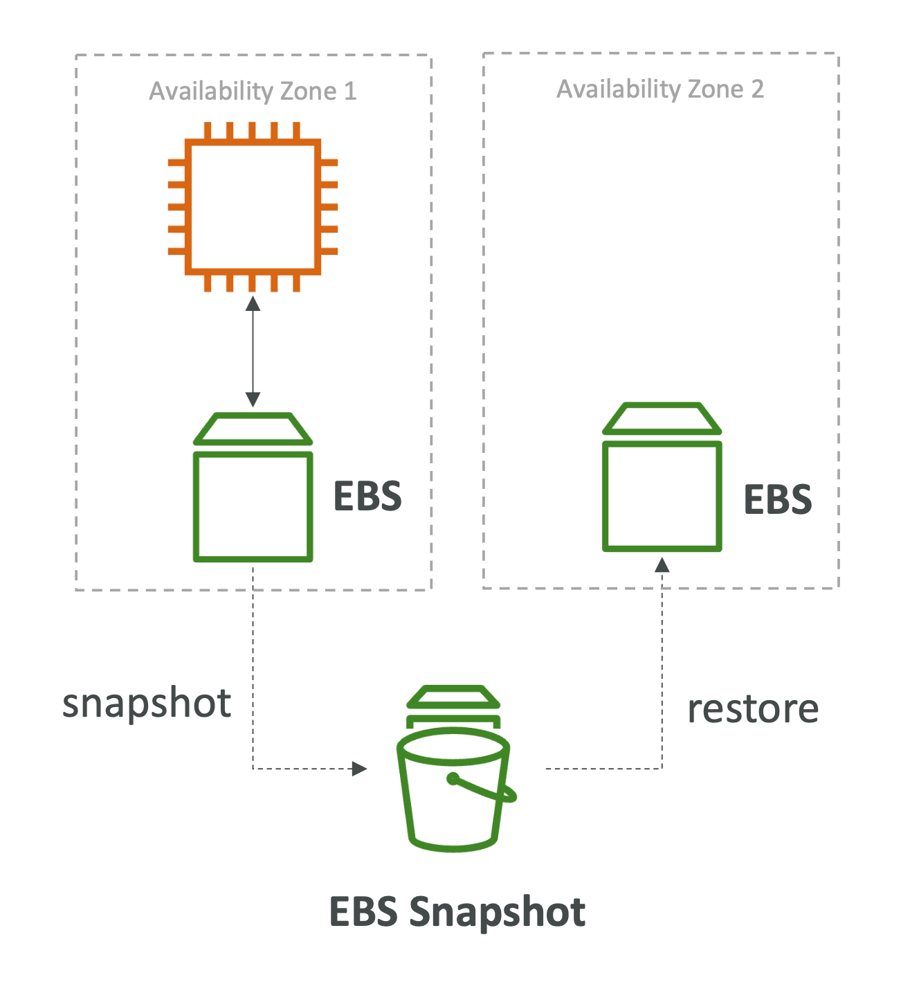
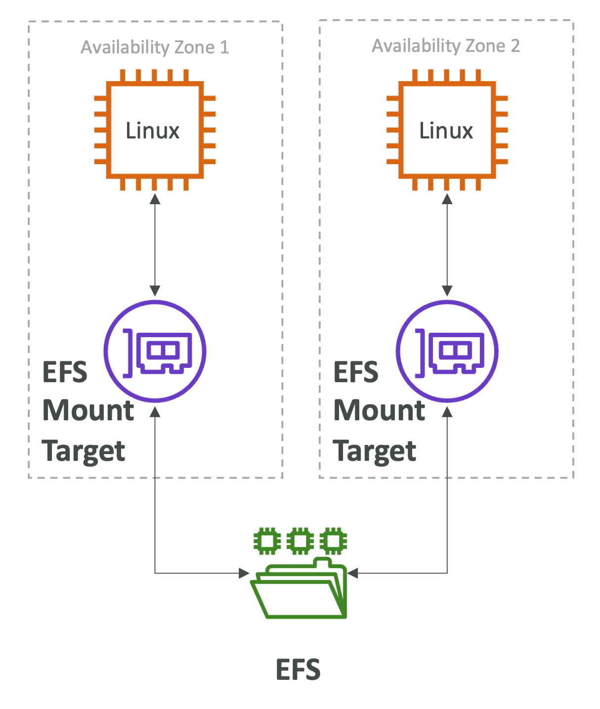

# AWS EBS vs EFS
- Remember: **EFS vs EBS vs Instance Store**

## EBS Volumes
    - one instance (except multi-attach io1/io2)
    - are locked at the **AZ level**
    - gp2: IO increases if the disk size increases
    - io1: can increase IO independently
- To migrate an EBS volume across AZ
    - Take a snapshot
    - Restore the snapshot to another AZ
    - EBS backups use IO and shouldn't run them while the application is handling a lot of traffic
- Root EBS volumes of instances get terminated by default if the EC2 instance gets terminated (can be disabled)

## EFS
- Mounting 100s of instances across AZ
- EFS share website files (Wordpress)
- Only for **Linux Instances** (POSIX)
- EFS has a higher price point than EBS
- Can leverage EFS-IA for cost-savings

