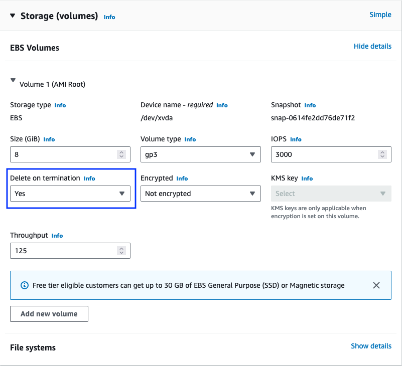
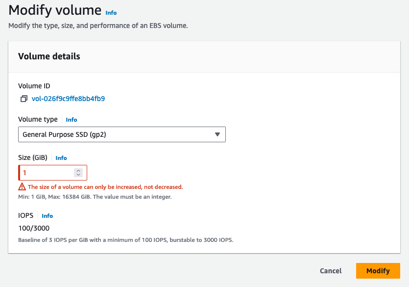
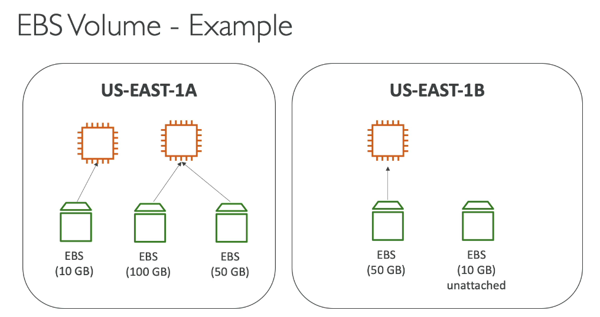
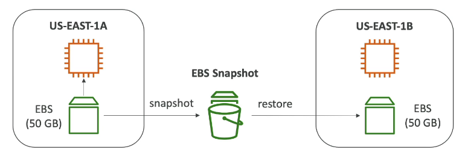
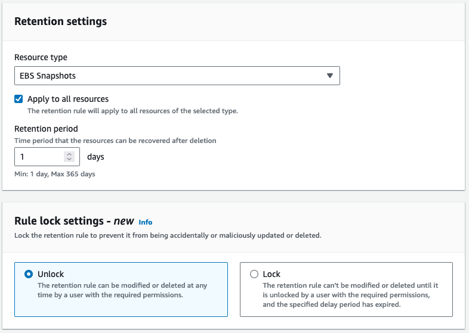

# AWS EBS Volume
- Elastic Block Store Volume is a network drive that can attach to the instances while they run
    - It uses the network to communicate the instance, which means there might be a bit of latency
    - It can be detached from an EC2 instance and attached to another one quickly
- It allows the instances to persist data, even after their termination
- They can only be mounted to one instance at a time
- They are bound to a specific AZ
    - An EBS Volume in `us-east-1a` cannot be attached to `us-east-1b`
    - To move a volume across, must make a snapshot first
- Analogy: as a **network USB stick**
- Free tier: 30 GB of free EBS storage of type Generate Purpose (SSD) or Magnetic per month
- Have a provisioned capacity (size in GBs and IOPS)
    - Can get billed for all the provisioned capacity
    - Can increase the capacity of the drive over time
- Can be enabled **Delete on Termination attribute**
    - Controls the EBS behaviour when an EC2 instance terminates
    - By default, **the root EBS volume** is deleted (attribute enabled)
    - By default, **any other volumes** attached EBS volume is not deleted (attribute disabled)
    - This can be controlled by the AWS console / AWS CLI
    - Use case: preserve root volume when instance is terminated



- Modify increase volume size only. **Don't decrease it**



## Examples



## Hands-on
- https://docs.aws.amazon.com/AWSEC2/latest/UserGuide/ebs-using-volumes.html

```bash
# list all of file system blocks
lsblk
lsblk -f

# read particular file information
file -s /dev/xvdf

# make file system
mkfs -t xfs

# mount and unmount volume
mkdir data
sudo mount /dev/xvdf data/
sudo umount /dev/xvdf
```

## EBS Snapshot
- Make a backup (snapshot) of your EBS volume at a point in time
- Unnecessary to detach volume to do snapshot, but recommended
- **Can copy snapshots across AZ or Region**



### EBS Snapshots Features
- EBS Snapshot Archive
    - Move a Snapshot to an **archive tier** that is 75% cheaper
    - Takes within 24 to 72 hours for restoring the archive
- Recycle Bin for EBS Snapshots
    - Setup rules to retain deleted snapshots so can recover them after an accidental deletion
    - Specify retention (from 1d to 1y)



- Fast Snapshot Restore (FSR): **Consume many cost**
    - Force full initialization of snapshot to have no latency on the first use

## EBS Volume Types
- EBS Volumes are characterized in Size | Throughput | IOPS (I/O Ops Per Sec)
- Types
    - gp2/gp3 (SSD)
        - General purpose SSD volume that balances price and performance for a wide variety of workloads
        - Cost effective storage, low latency
        - System boot volumes, Virtual desktops, Development and test environments
        - 1 GiB - 16 TiB
        - gp3:
            - Baseline of 3000 IOPS and throughput of 125 MiB/s
            - Can increase IOPS up to 16000 and throughput up to 1000 MiB/s independently
        - gp2:
            - Small gp2 volumes can burst IOPS to 3000
            - Size of the volume and IOPS are linked, max IOPS is 16000
            - 3 IOPS per GB, means at 5334 GB we are at the max IOPS
    - io1/io2 (SSD)
        - Highest-performance SSD volume for mission-critical low-latency or high-throughput workloads
        - Critical business applications with sustained IOPS performances
        - Applications that need more than 16000 IOPS
        - Great for **database workloads** (sensitive to storage performance and consistency)
        - 4 GiB - 16 TiB
        - Max PIOPS: 64000 for Nitro EC2 instances and 32000 for other
        - Can increase PIOPS independently from storage size
        - io2 have more durability and more IOPS per GiB (at the same price as io1)
        - io2 Block Express (4 GiB - 64 TiB)
            - Sub-millisecond latency
            - Max PIOPS: 256000 with an IOPS
            - GiB ratio of 1000:1
        - **Supports EBS Multi-attach**
    - st1 (HDD)
        - Low cost HDD volume designed for frequently accessed, throughput-intensive workloads
        - Cannot be a boot volume
        - 125 GiB - 16 TiB
        - Throughput Optimized HDD
            - Big Data, Data Warehouses, Log Processing
            - Max throughput 500 MiB/s
            - Max IOPS 500
    - sc1 (HDD)
        - Lowest cost HDD volume designed for less frequently accessed workloads
        - For data that is frequently accessed
        - Scenarios where lowest cost is important
        - Max throughput 250 MiB/s
        - Max IOPS 250
- Only gp2/gp3 and io1/io2 can be used as boot volumes
- https://docs.aws.amazon.com/AWSEC2/latest/UserGuide/ebs-volume-types.html

## EBS Multi-Attach (io1/io2)
- Attach the same EBS volume to multiple EC2 instances in the same AZ
- Each instance has full read and write permissions to the high-performance volume
- User case
    - Achieve higher application availability in clustered Linux applications
    - Applications must manage concurrent write operations
- Up to **16 EC2 Instances** at a time
- Must use a file system that's cluster-aware (not XFS, EXT4)
