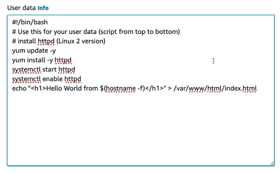
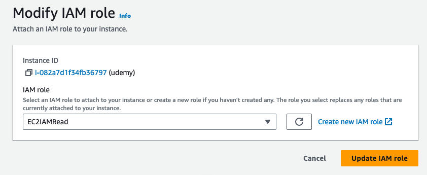
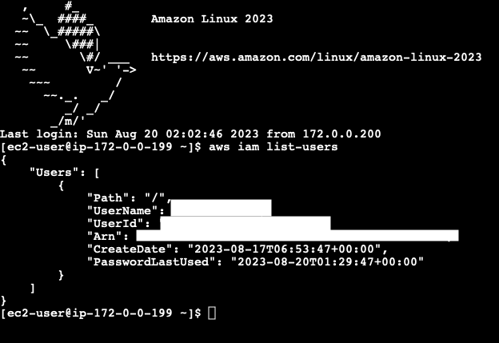
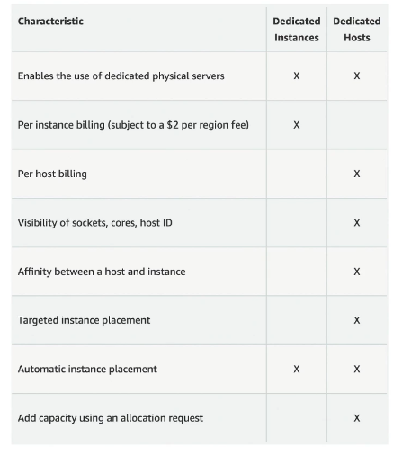
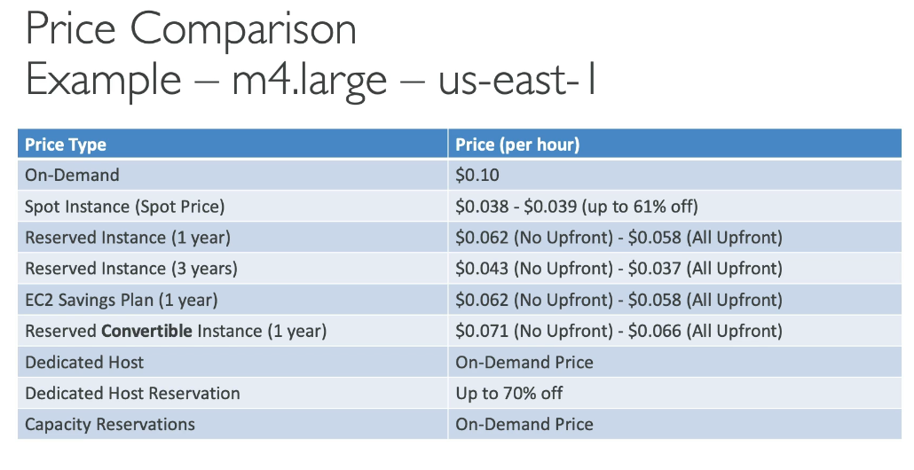

# AWS EC2
- Don't use `aws configure` on EC2 Instance because of **non safety**
- Pricing comparison:
    - https://instances.vantage.sh/
- Elastic Compute Cloud = Infrastructure as a Service
- Knowing EC2 is fundamental to understand how the Cloud works
- It mainly consists in the capability of:
    - Renting virtual machines (EC2)
    - Storing data on virtual drives (EBS)
    - Distributing load across machines (ELB)
    - Scaling the services using an auto-scaling group (ASG)

## Sizing and configuration options
- OS
- CPU
- RAM
- Storage space:
    - Network-attached (EBS & EFS)
    - Hardware (EC2 Instance Store)
- Network Card: speed of the card, public IP Address
- Firewall rules: Security Group
- Bootstrap script (configure at first launch): EC2 User Data

## EC2 User Data
- It is possible to bootstrap our instances using an EC2 User Data script
- Bootstrapping means launching commands when a machine starts
- That script is **only run once at the instance first start**
- Used to automate boot tasks such as:
    - Installing updates
    - Installing software
    - Downloading common files from the internet
- Runs with the **root user**

## EC2 Instance Types
- https://aws.amazon.com/ec2/instance-types/
- `t2.micro` is part of the AWS free tier (up to 750 hours per month)
- Naming convention: m5.2xlarge
    - m: instance class
    - 5: generation (AWS improves them over time)
    - 2xlarge: size within the instance class

### General Purpose (T/M/A)
- Great of a diversity of workloads such as web servers or code repositories
- Balance (networking, compute, memory)

### Compute Optimized (C)
- Great for compute-intensive tasks that require high performance processors:
- Use cases:
    - Batch processing workloads
    - Media transcoding
    - High performance web servers
    - High performance computing (HPC)
    - Scientific modeling and machine learning
    - Dedicated gaming servers

### Memory Optimized (R/X/z/High Memory)
- Fast performances for workloads that process large data sets in memory
- Use cases:
    - High performance, relational/non-relational databases
    - Distributed web scale cache stores
    - In-memory databases optimized for BI (Business intelligence)
    - Applications performing real-time processing of big unstructured data

### Storage Optimized (I/D/H)
- Great for storage-intensive tasks that require high, sequential read and write access to large data sets on local storage
- Use cases:
    - High frequency online transaction processing (OLTP) systems
    - Relational and NoSQL databases
    - Cache for in-memory databases (Redis)
    - Data warehousing applications
    - Distributed file systems

## EC2 Instance Connect
- Support Public IP and Private IP with Endpoint

### Before attached IAM roles to EC2 Instance

### After

## EC2 Instances Purchasing Options
- On-Demand Instances: short workload, predictable pricing, pay by second
    - Pay for what you use:
        - Linux or Windows: billing per second, after the first minute
        - All other operating systems: billing per hour
    - Has the highest cost but no upfront payment
    - No long-term commitment
    - Recommended for short-term and un-interrupted workloads, where you can't predict how the application will behave
- Reserved (1-3 years)
    - Reserved Instances: long workloads
        - Reserve a specific instance attributes (Instance Type, Region, Tenancy, OS)
        - Reservation Period (1y or 3y)
        - Payment Options
            - No Upfront
            - Partial Upfront
            - All Upfront
        - Reserved Instance's Scope: Regional or Zonal (reserve capacity in an AZ)
        - Recommended for steady-state usage applications (database, etc.)
        - Can by and sell in the Reserved Instance Marketplace
    - Convertible Reserved Instances: long workloads with flexible instances
        - Can change the EC2 instance type, instance family, OS, scope and tenancy
- Savings Plans (1-3 years): commitment to an amount of usage, long workload
    - Get a discount based on long-term usage
    - Commit to a certain type of usage ($10/h for 1y or 3y)
    - Usage beyond EC2 Savings Plans is billed at the On-Demand price
    - Locked to a specific instance family and region
    - Flexible across:
        - Instance Size
        - OS
        - Tenancy (Host, Dedicated, Default)
- Spot Instances: short workloads, cheap, can lose instances (less reliable)
    - *Not suitable for critical jobs or databases*
    - Can get a highest discount compared to On-Demand
    - Instances that can **lose** at any point of time if your max price is less than the current spot price
    - The **most cost-efficient** instances in AWS
    - Useful for workloads that are **resilient to failure**
        - Batch jobs
        - Data analysis
        - Image processing
        - Any distributed workloads
        - Workloads with a flexible start and end time
- Dedicated Hosts: book an entire physical service, control instance placement
    - The **most expensive option**
    - A physical server with EC2 instance capacity fully dedicated to use
    - Allows address **compliance requirements** and **use existing server-bound software licenses** (per socket, per core, per VM software licenses)
    - Purchasing Options:
        - On-Demand: pay per second for active Dedicated Host
        - Reserved: 1y or 3y (No Upfront, Partial Upfront, All Upfront)
    - Useful for software that have complicated licensing model (BYOL - Bring Your Own License)
    - Or for companies that have strong regulatory or compliance needs
- Dedicated Instances: no other customers will share your hardware
    - May share hardware with other instances in the same account
    - No control over instance placement: can move hardware after Stop / Start
- Capacity Reservations: reserve capacity in a specific AZ for any duration
    - Reserve On-Demand instances capacity in a specific AZ for any duration
    - Always have access to EC2 capacity when need it
    - No tiem commitment (create/cancel anytime), no billing discounts
    - Combine with Regional Reserved Instances and Savings Plans to benefit from billing discounts
    - Charged at On-Demand rate whether **run instances or not**
    - Suitable for short-term, uninterrupted workloads that needs to be in a specific AZ

## Which purchasing option is right for me?
- On demand: coming and staying in resort whenever we like, we pay the full price
- Reserved: like planning ahead and if we plan to stay for a long time, we may get a good discount
- Savings Plans: pay a certain amount per hour for certain period and stay in any room-type
- Spot instances: the hotel allows people to bid for the empty rooms and the highest bidder keeps the rooms. *You can get kicked out at any time*
- Dedicated Hosts: we book an entire building of the resort
- Capacity Reservations: book a room for a period with full price even you don't stay in it

## EC2 Instance Store
- https://docs.aws.amazon.com/AWSEC2/latest/UserGuide/storage-optimized-instances.html
- EBS volumes are **network drives** with good but **limited** performance
- If need a high-performance hardware disk, use EC2 Instance Store
- Reasons:
    - Better I/O Performance
    - EC2 Instance Store lose their storage if they're stopped (ephemeral)
    - Good for buffer / cache / scratch data / temporary content
    - Risk of data loss if hardware fails
    - Backups and Replication are your responsibility
