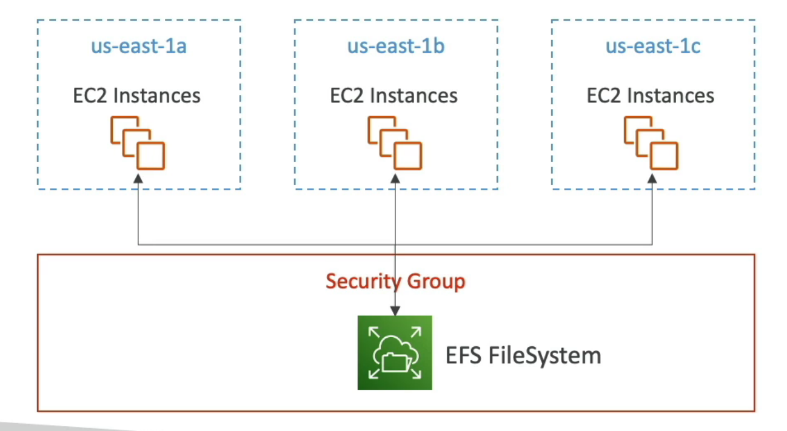
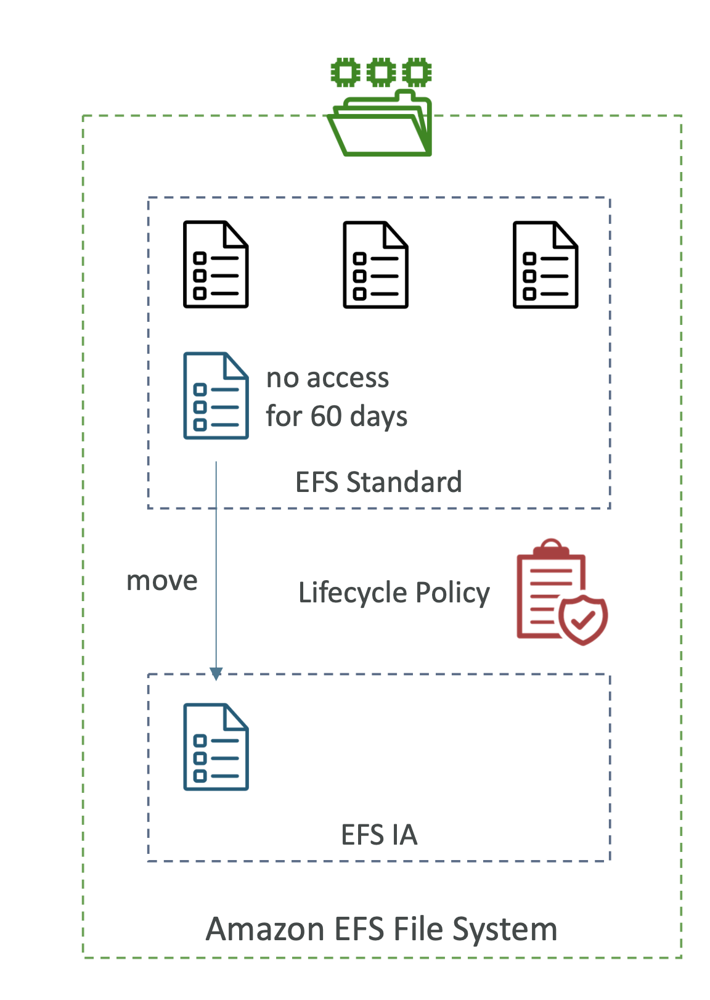

# AWS EFS
- Elastic File System
- Managed NFS (netowkr file system) that can be mounted on many EC2
- EFS works with EC2 instance in multi-AZ
- Highly available, scalable, expensive (3x gp2), pay per use
- Use cases: content management, web serving, data sharing, Wordpress
- Uses NFSv4.1 protocol
- Use security group to control access to EFS
- Compatible with **Linux based AMI** (not Windows)
- Encryption at rest using KMS
- POSIX file system (~Linux) that has a standard file API
- File system scales automatically, per per use, no capacity planning

## Performance and Storage Classes
- EFS Scale
    - 1000s of concurrent NFS clients, 10 GB+ /s throughput
    - Grow to Petabye-scale network file system, automatically
- Performance Mode (set at EFS creation time)
    - General Purpose (default):latency-sensitive use cases
    - Max I/O: higher latency, throughput, highly parallel (big data, media processing)
- Throughput Mode
    - Bursting: 1 TB = 50 MiB/s + burst of up to 100 MiB/s
    - Provisioned: set throughput regardless of storage size (1 GiB/s for 1 TB storage)
    - Elastic: automatically scales throughput up or down based on workloads
        - Up to 3 GiB/s for reads and 1 GiB/s for writes
        - Used for unpredictable workloads

## Storage Classes
- Storage Tiers (lifecycle management feature: move file after N days)
    - Standard: for **frequently accessed files**
    - **Infrequent access** (EFS-IA)
        - Cost to retrieve files
        - Lower price to store
        - Enable EFS-IA with a lifecycle policy
- Availability and durability
    - Standard Multi-AZ, great for prod
    - One Zone: One AZ, great for dev, backup enabled by default, compatible with IA (EFS One Zone - IA)
- Over 90% in cost savings

