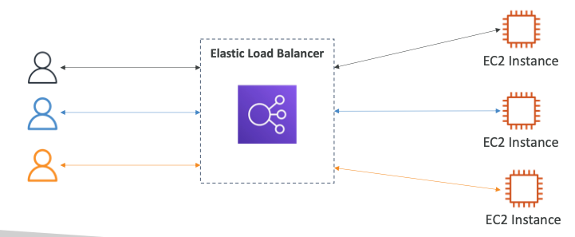
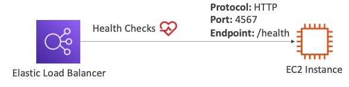
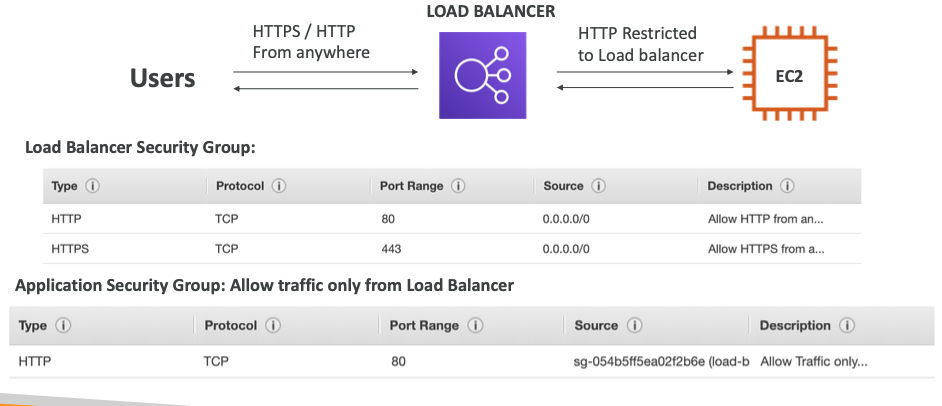

# Elastic Load Balancing
## What is load balancing?
- Load Balancers are servers that forward traffic to multiple servers downstream

## Why use load balancer?
- Spread load across multiple downstream instances
- Expose a single point of access (DNS) to the application
- Seamlessly handle failures of downstream instances
- Do regular health checks to the instances
- Provide SSL termination (HTTPS) for the websites
- Enforce stickiness with cookies
- High availability across zones
- Separate public traffic from private traffic

## Why use an ELB?
- An ELB is a **managed load balancer**
    - AWS guarantees that it will be working
    - AWS takes care of upgrades, maintenance, ha
    - AWS provides only a few configuration knobs
- It costs less to setup own load balancer but it will be a lot more effort on your end
- It is integrated with many AWS offerings / services
    - EC2 , EC2 Auto Scaling Groups, Amazon ECS
    - AWS Certificate Manager (ACM), CloudWatch
    - Route 53, AWS WAF, AWS Global Accelerator

## Health Checks
- Health Checks are crucial for Load Balancers
- They enable the load balancer to know if instances it forwards traffic to are available to reply to requests
- The health check is done on a port and a route (/heath is common)
- If the response is not 200 (OK), then the instance is unhealthy

## Types of load balancer on AWS
- AWS has **4 kinds of managed Load Balancers**
- `[Deprecated] Classic Load Balancer (v1 - old generation) - CLB`
    - HTTP, HTTPS, TCP, SSL (secure TCP)
- Application Load Balancer (v2 - new generation) - ALB
    - HTTP, HTTPS, WebSocket
- Network Load Balancer (v2 - new generation) - NLB
    - TCP, TLS (secure TCP), UDP
- Gateway Load Balancer - GWLB
    - Operates at layer 3 **(Network Layer)**
    - IP Protocol
- Overall, it is recommended to use the newer generation load balancers as they provide more features
- Some load balancers can be setup as **internal (private)** or **external (public)** ELBs

## Load Balancer Security Groups

