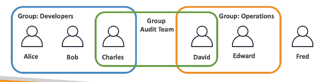
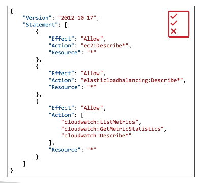
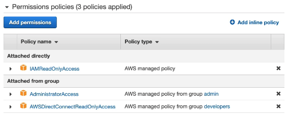
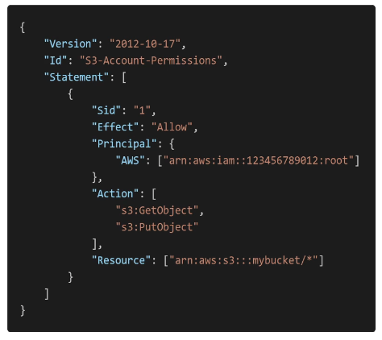
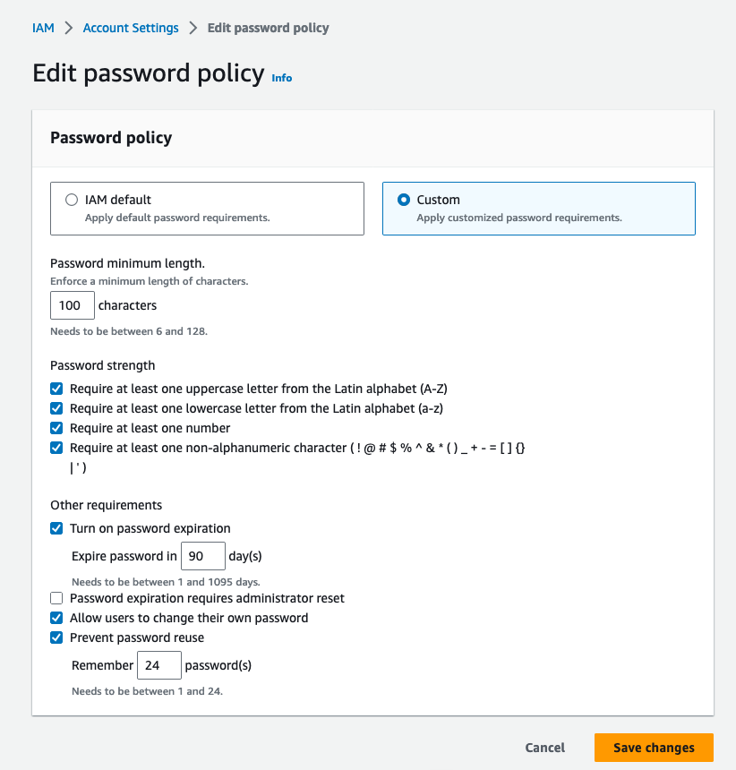
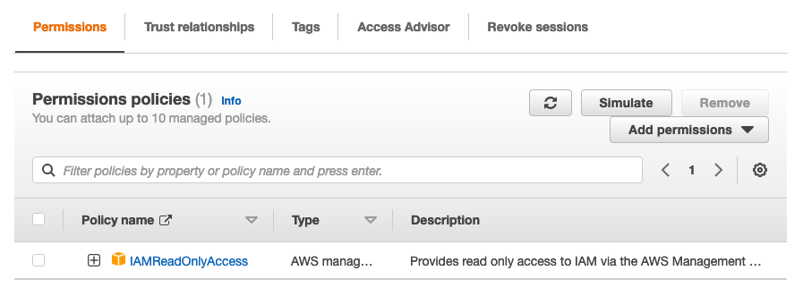
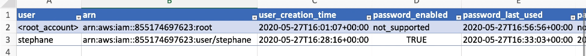
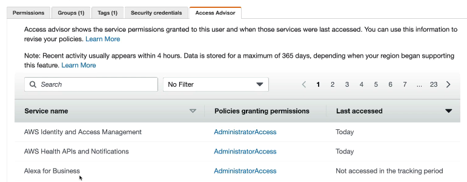

# Summary
- Users: mapped to a physical user, has a password for AWS Console
- Groups: contains users only
- Policies: JSON document that outlines permissions for users or groups
- Roles: for EC2 instances or AWS services
- Security: MFA + Password Policy
- AWS CLI: manage your AWS services using the command-line
- AWS SDK: manage your AWS services using a programming language
- Access Keys: access AWS using the CLI or SDK
- Audit: IAM Credential Reports and IAM Access Advisor

# IAM Best Practices
- Don't use the root account except for AWS account setup
- One physical user = One AWS user
- Assign users to groups and assign permissions to groups
- Create a strong password policy
- Use and enforce the use of MFA
- Create and use Roles for giving permissions to AWS services
- Use Access Keys for Programmatic Access (CLI/SDK)
- Audit permissions of the account using IAM Credentials Report and IAM Access Advisor
- **Never share IAM users and Access Keys**

# IAM: Users and Groups
- IAM = Identity and Access Management, Global Services
- Root account created by default, shouldn't be used or shared
- Users are people within your organization, and can be grouped
- Users don't have to belong to a group, and user can belong to multiple groups

# IAM: Permissions
- Users or Groups can be assigned JSON documents called policies
- These policies define the permissions of the users
- In AWS you apply the least privilege principle
    - **Don't give more permissions than a user needs**

# IAM Policies inheritance
- Policies from group that can be overridden directly policies

## IAM Policies Structure
- Consists of
    - Version: policy language version
    - Id: an identifier for the policy (optional)
    - **Statement**: one or more individual statements (required)
- Statements consists of
    - Sid: an identifier for the statement (optional)
    - Effect: whether the statement allows or denies access (Allow, Deny)
    - Principal: account/user/role to which this policy applied to
    - Action: lost of actions this policy allows or denies
    - Resource: list of resources to which the actions applied to
    - Condition: conditions for when this policy is in effect (optional)

## IAM Password Policy
- Strong passwords = higher security for the accounts
- Allow all IAM users to change their own passwords
- Require users to change their password after some period time (password expiration)
- Prevent password re-use
- A password policy:
    - Set a minimum password length
    - Require specific character types:
        - uppercase letters
        - lowercase letters
        - numbers
        - non-alphanumeric characters

### Multi Factor Authentication (MFA)
- Users have access to the account and can possibly change configurations or delete resources
- Want to protect **Root Accounts and IAM users**
- MFA = known password + security devices
- Benefit: if a password is stolen or hacked, the account is not compromised
- Types
    - Virtual MFA Device: support for multiple tokens on a single device
        - Google Authenticator
        - Authy
    - Universal 2nd Factor (U2F) Security Key
        - YubiKey
    - Hardware Key Fob MFA Device
    - Hardware Key Fob MFA Device for AWS GovCloud (US)

# IAM Roles
- Some AWS service will need to perform actions on the behalf
- Assign permissions to AWS services with IAM Roles
- Common roles
    - EC2 Instance Roles
    - Lambda Function Roles
    - Roles for CloudFormation

## IAM Security Tools
- IAM Credentials Report (account-level)
    - A report that lists all your account's users and the status of their various credentials

- IAM Access Advisor (user-level)
    - Access advisor shows the service permissions granted to a user and when those services were last accessed
    - Can use this information to revise the policies

# Shared Responsibility Model for IAM
- AWS
    - Infrastructure (global network security)
    - Configuration and vulnerability analysis
    - Compliance validation
- Owner
    - Users, Groups, Roles, Policies management and monitoring
    - Enable MFA on all accounts
    - Rotate all your keys often
    - Use IAM tools to apply appropriate permissions
    - Analyze access patterns and review permissions
