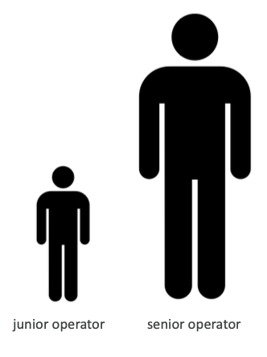
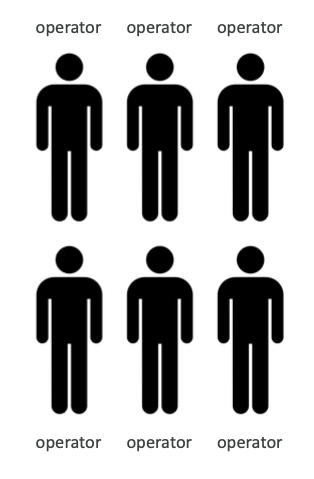
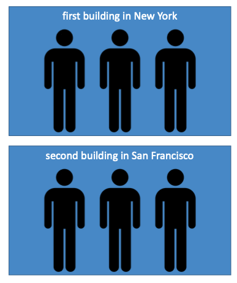

# Scalability and High Availability
## Scalability
- Scalability means that an application / system can handle greater loads by adapting
- **Scalability is linked but different to HA**
- There  are two kinds of scalability
    - Vertical Scalability
        - LIKE **increase sizing**
        - means increasing the size of the instance
        - Scaling that application vertically means running it on a `t2.large`
        - Vertical scalability is very common for non distributed systems, such as database
        - RDS, ElastiCache are services that can scale vertically
        - There is usually a limit to how much you can vertically scale (hardware limit)

    - Horizontal Scalability **(elasticity)**
        - LIKE **duplicate itself**
        - means increasing the number of instances / systems for application
        - Horizontal scaling implies distributed systems
        - This is very common for web applications / modern applications
        - It is easy to horizontally scale like the cloud offerings such as EC2

## High Availability
- High Availability usually goes hand in hand with horizontal scaling
- High Availability means running the application / system in at least 2 data centers
- The goal of high availability is to survive a data center loss
- The high availability can be passive (for RDS Multi AZ)
- The high availability can be active (for horizontal scaling)

## For EC2
- Vertical Scaling: increase instance size **(= scale up and down)**
    - From: `t2.nano` - 0.5G of RAM, 1 vCPU
    - To: `u-12tb1.metal` - 12.3TB of RAM, 448 vCPUs
- Horizontal Scaling: increase number of instances **(= scale in and out)**
    - Auto Scaling Group
    - Load Balancer
- HA: run instances for the same application across multi AZ
    - Auto Scaling Group multi AZ
    - Load Balancer multi AZ
