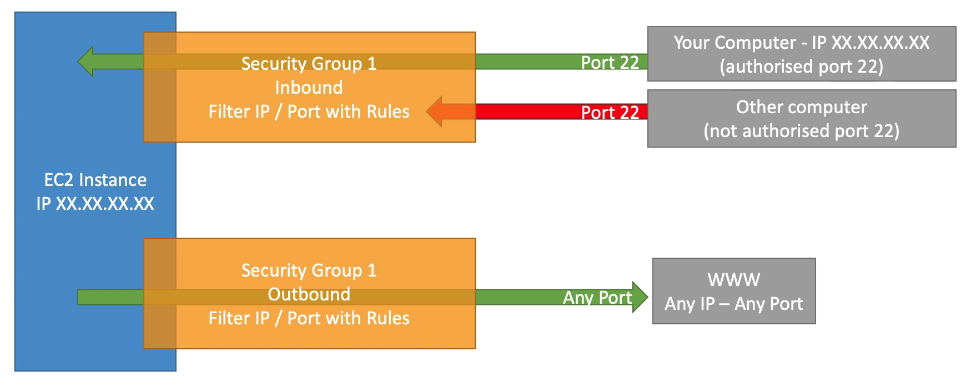
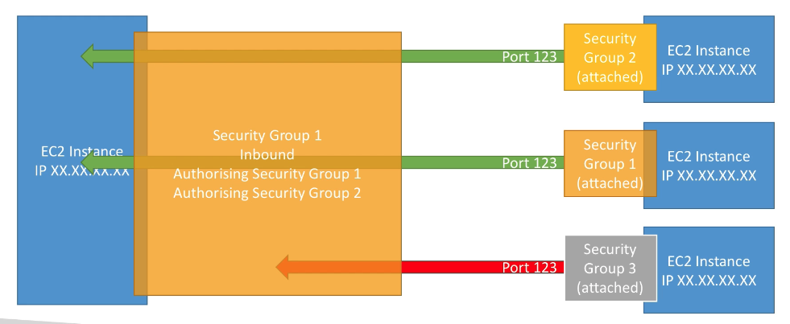

# Security Groups
- Security Groups are the fundamental of network security in AWS
- They control how traffic is allowed into or out of our EC2 instances
- Security groups **only contain allow rules**
- Security groups rules can reference by IP or by security group

## Deeper Dive
- Security groups are acting as a "firewall" on EC2 instances
- They regulate:
    - Access to Ports
    - Authorized IP ranges - IPv4 and IPv6
    - Control of inbound network (from other to the instance)
    - Control of outbound network (from the instance to other)

## Diagram

## Good to known
- Can be attached to multiple instances
- Locked down to a region/VPC combination
- Does live **outside** the EC2
    - If traffic is blocked the EC2 instance won't see it
- It's good to maintain one separate security group for SSH access
- If your application is not accessible (timeout), then it's a security group issue
- If your application gives a **connection refused** error, then it's an application error or it's not launched
- All inbound traffic is **blocked** by default
- All outbound traffic is **authorize** by default

## Referencing other security groups

