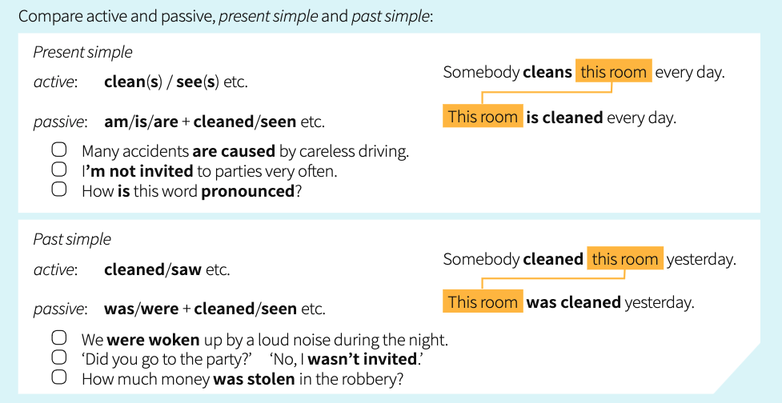

# Unit 42 - Passive 1 (is done/ was done)
## Case A
- When we use an **active verb**, we say what the subject does:
    - My grandfather was a builder. He built this house in 1981.
    - It's a big company. It employs two hundred people.
- When we use a **passive verb**, we say what happens to the subject:
    - 'How old is this house?' 'It was built in 1981.'
    - Two hundred people are employed by the company.

## Case B
- When we use the passive, who or what causes the action is often unknown or unimportant:
    - A lot of money **was stolen** in the robbery.
    - **Is** this room **cleaned** every day?
- If we want to say who does or what causes the action, we use **by**:
    - This house was built **by my grandfather**.
    - Two hundred people are employed **by the company**.

## Case C
- The passive is **be** (is/was etc.) + past participle (done/cleaned/seen etc.):
- The past participle often ends in **-ed**, but many important verbs are *irregular*.

## Active vs Passive

## Exercises
### 42.1
1. Many accidents **are caused** by careless driving.
2. Cheese **is made** from milk.
3. The roof of the building **was damaged** in a storm a few days ago.
4. A cinema is a place where films **are shown**.
5. You **were invited** to the party. Why didn't you go?
6. This plant is very rare. It **is found** in very few places.
7. Although we were driving fast, we **were overtaken** by a lot of other cars.
8. In the US, elections for president **are held** every four years.
9. There was an accident last night, but fortunately nobody **was injured**.
10. You can't see the house from the road. It **is surrounded** by trees.
11. I never received the letter. It **was sent** to the wrong address.
12. The company I work for **is owned** by a much larger company.

### 42.2
1. How **is** glass **mode**?
2. When **was** television **invented**?
3. How **are** mountains **formed**?
4. When **was** DNA **discovered**?
5. What **is** silver **used for**?

### 42.3
- Two hundred people **are employed** by the company.
- The company **employs** two hundred people.
- Water **covers** most of the earth's surface.
- How much of the earth's surface **is covered** by water?
- While I was on holiday, my camera **was stolen** from my hotel room.
- While I was on holiday, my camera **disappeared** from my hotel room.
- Robert's parents **died** when he was very young.
- Robert and his sister **were brought up** by their grandparents.
- The boat hit a rock and **sank** quickly.
- Fortunately everybody **was rescued**.
- Bill **was fired** from his job. He wasn't very good at it.
- Sue **resigned** from her job because she didn't enjoy it any more.
- It can be noisy living here, but it **doesn't bother** me.
- It can be noisy living here, but I **am not bothered** by it.
- Maria had an accident. She **was knocked** off her bike.
- Maria had an accident. She **fell** off her bike.
- I haven't seen these flowers before. What **are** they **called**?
- I haven't seen these flowers before. What **do** you **call** them?

### 42.4
1. The room **is cleaned** every day.
2. All flights **were cancelled** because of fog.
3. I **was accused** of stealing money.
4. How **is** this word **used**?
5. All taxes **are included** in the price.
6. We **were warned** not to go out alone.
7. This office **isn't used** any more.
8. Five hundred people **were invited** to the wedding.

# Unit 43 - Passive 2 (be done / been done / being done)
## Case A: Infinitive
- Active: Somebody **will clean** this room later.
- Passive: This room **will be cleaned** later.

## Case B: Perfect Infinitive
- Active: Somebody **should have cleaned** the room.
- Passive: The room **should have been cleaned**.

## Case C: Present Perfect
- Active: The room looks nice. Somebody **has cleaned** it.
- Passive: The room **should have been cleaned**.

## Case C: Past Perfect
- Active: The room looked nice. Somebody **had cleaned** it.
- Passive: The room looked nice. It **has been cleaned**.

## Case D: Present Continuous
- Active: Somebody **is cleaning** the room at the moment.
- Passive: The room **is being cleaned** at the moment.

## Case D: Past continuous
- Active: Somebody **was cleaning** the room when I arrived.
- Passive: The room **was being cleaned** when I arrived.
