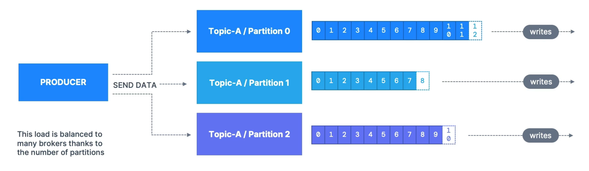
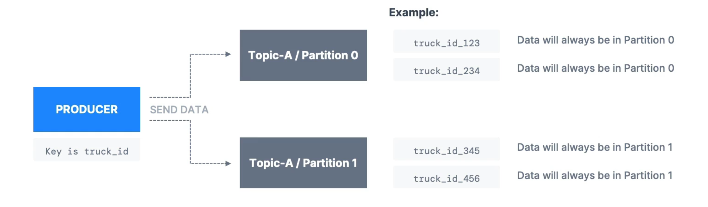
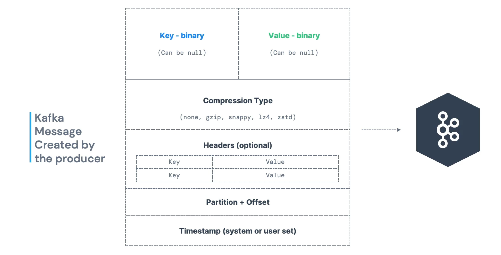
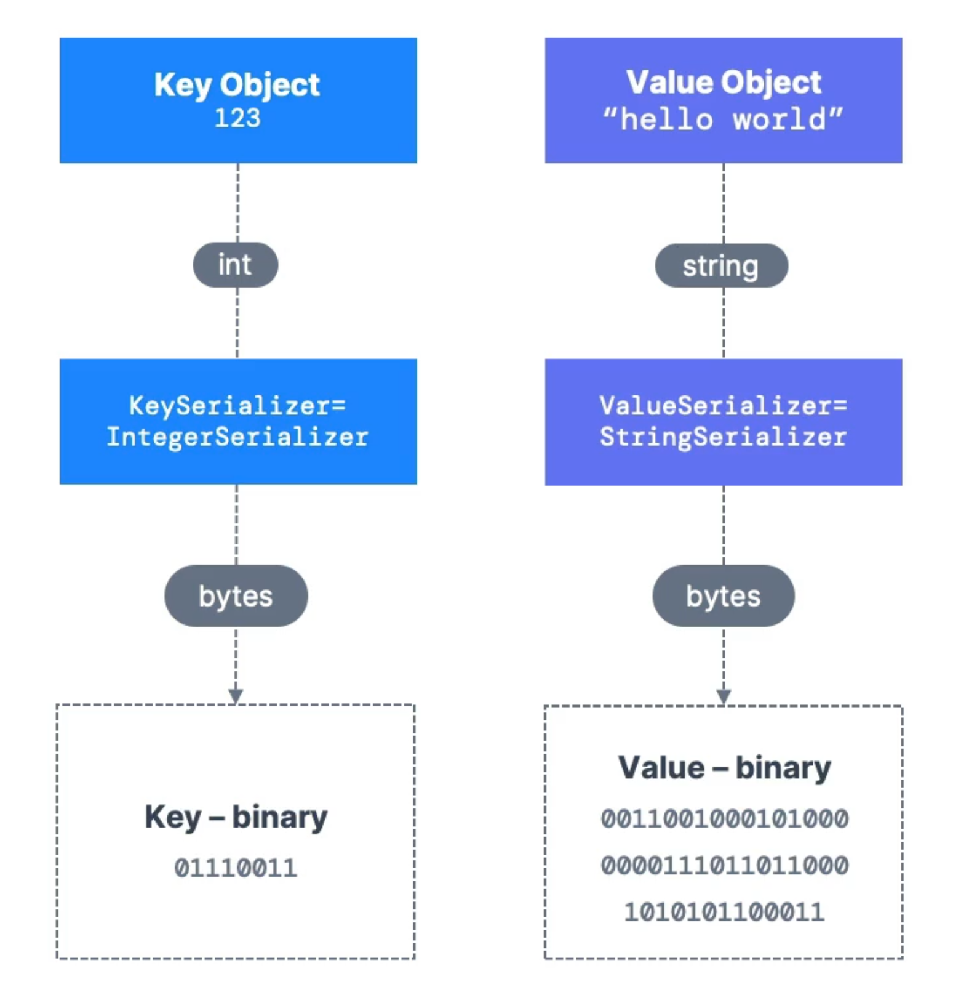

# Producers

- Producers write data to topics which is made of partitions
- Producers know to which partition to write to and which **Kafka Broker** has it
- In case of Kafka broker failures, **Producers will automatically recover**

## Message Keys

- Producers can choose to send a **key** with the message (string, number, binary, etc.)
- If **key is null**, data is sent round robin (part 0, part 1, part n+1)
- If **key is not null**, then all messages for that key will always go to the same partition (hashing)
- A key are typically sent if need message ordering for a specific filed

## Kafka Message

### Kafka Message Serializer

- Kafka only accepts bytes as an input from producers and sends bytes out as an output to consumers
- Message Serialization means transforming objects / data into bytes
- They are used on the value and the key
- Common Serializers
  - String + JSON
  - Int, Float
  - Avro
  - Protobuf

