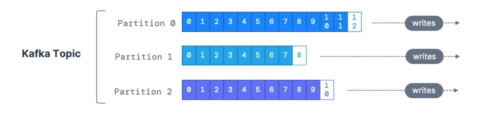

# Summary

- Once the data is written to a partition, **it cannot be changed** (immutability)
- Data is kept only for a limited time (default is one week)
- Offset only have a meaning for a specific partition
  - Offset 3 in partition 0 doesn't represent same data as offset 3 in partition 1
  - Offsets are not re0used even if previous messages have been deleted
- Order is guaranteed only within a partition (not across partitions)
- Data is assigned randomly to a partition unless a key is provided
- Can have as many partitions per topic as we want

# Topics

- **Topics** is a particular stream of data
- Like a table in database (without all the constraints)
- Can have as many topics as want
- A topic is identified by its name
- Any kind of message format
- The sequence of messages is called a **data stream**
- Cannot query topics, instead use **Kafka Producers** to send data and **Kafka Consumers** to read the data

# Partitions and Offsets

- Topics are split in **partitions**
  - Messages within each partition are ordered
  - Each message within a partition gets an incremental id, called **offset**
- Kafka topics are **immutable**
  - Once data is written to a partition, it cannot be changed
