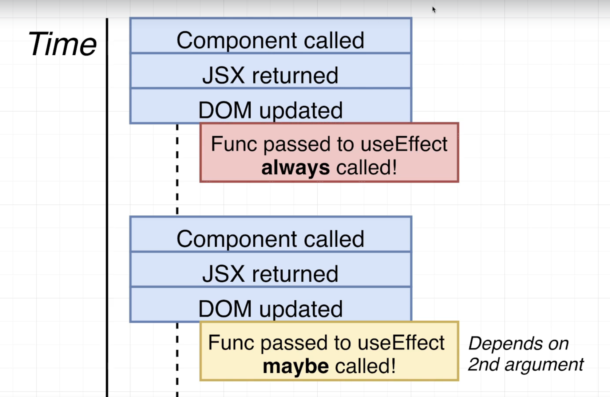

# UseEffect
- Used to run code when a component is **initially rendered** and (sometimes) **when it is rerendered**
- first argument is a function that contains code want to run
- second argument is optional array for controls whether the function is executed on rerenders
- https://react.dev/reference/react/useEffect



```javascript
useEffect(func);
useEffect(func, [value]);

// run every component re-rendering
useEffect(() => {});

// initial rendering only
useEffect(() => {}, []);

// re-render every value has changed
useEffect(() => {}, [value]);

// with clean up function that will be run before second component re-render
useEffect(() => {
    // connect to server
    return () => {
        // handle disconnect from server
    };
});
```
